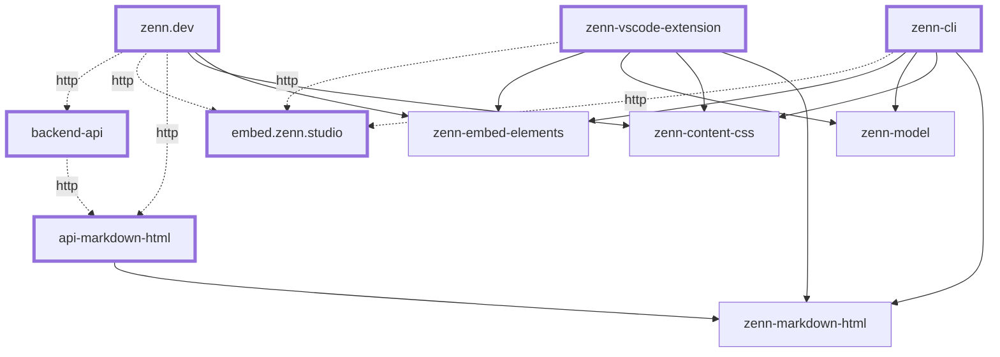

# Overview

このページではZennの全体像を知ってもらうため、Zennの各サービス、ツール、パッケージの概要とそれらの依存関係について説明します。

## 依存関係グラフ

Zennの各サービス、ツール、パッケージの依存関係グラフを以下に示します。

- 実線: npmパッケージに依存
- 破線: APIを呼び出すなど間接的に依存

## サービス

### zenn.dev

Zennのメインサービスです。Next.jsのプロジェクトです。

リポジトリは非公開。

### backend-api

zenn.devのバックエンドサーバーです。Ruby on Railsのプロジェクトです。

リポジトリは非公開。

### embed.zenn.studio

markdownの埋め込み要素を表示するためのiframeを返すサーバーです。Next.jsのプロジェクトです。

リポジトリは非公開。

### api-markdown-html

markdownをZennで表示可能なHTMLに変換するAPIです。`zenn-markdown-html` をラップしたCloud Functions(Node.js)のプロジェクトです。

リポジトリは非公開。

## ツール

### zenn-cli

markdownをローカルで作成・プレビューするためのCLIとWebのツールです。JavaScript(TypeScript)とNode.jsのプロジェクトです。

[GitHubリポジトリ](https://github.com/zenn-dev/zenn-editor/tree/main/packages/zenn-cli)

### zenn-vscode-extension

markdownをVSCode for the Web(github.devなど)で作成・プレビューするためのVSCode Web拡張機能です。JavaScript(TypeScript)のプロジェクトです。

[GitHubリポジトリ](https://github.com/zenn-dev/zenn-vscode-extension)

## パッケージ

### zenn-content-css

ZennのHTMLに適用するCSSを提供するパッケージです。

[GitHubリポジトリ](https://github.com/zenn-dev/zenn-editor/tree/main/packages/zenn-content-css)

### zenn-embed-elements

markdownの埋め込み要素をクライアント側でHTMLに変換するパッケージです。

[GitHubリポジトリ](https://github.com/zenn-dev/zenn-editor/tree/main/packages/zenn-embed-elements)

### zenn-markdown-html

markdownをZennで表示可能なHTMLに変換するパッケージです。

[GitHubリポジトリ](https://github.com/zenn-dev/zenn-editor/tree/main/packages/zenn-markdown-html)

### zenn-model

zenn で扱うデータのユーティリティ型や関数をまとめたパッケージです。

[GitHubリポジトリ](https://github.com/zenn-dev/zenn-editor/tree/main/packages/zenn-model)
