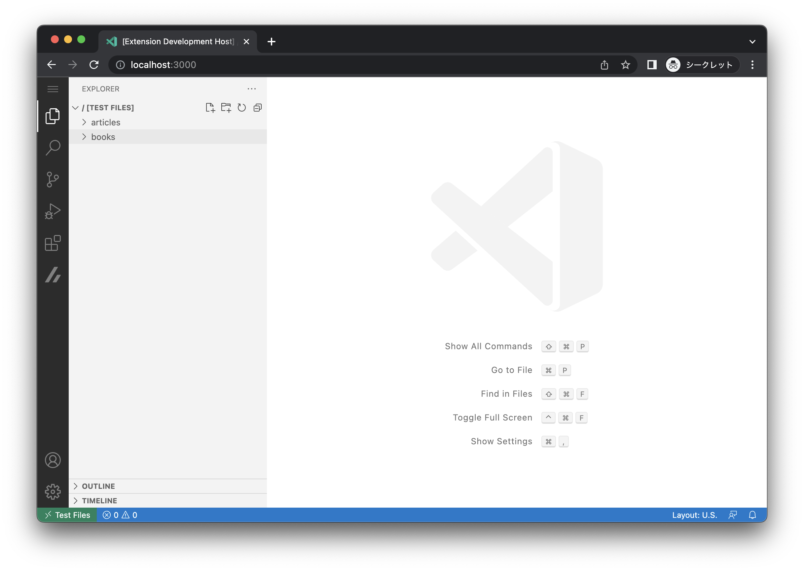
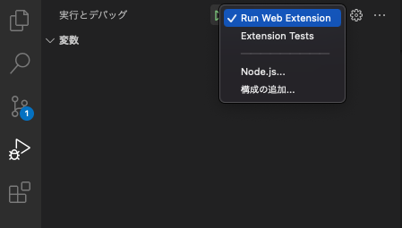
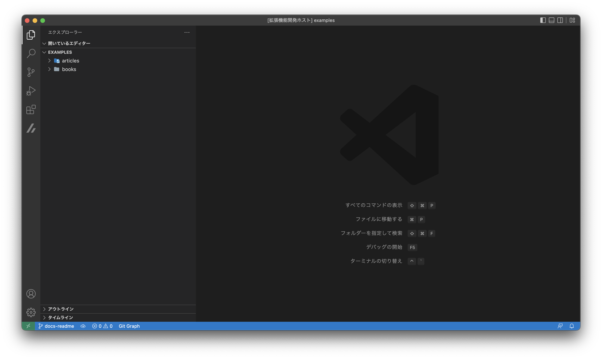
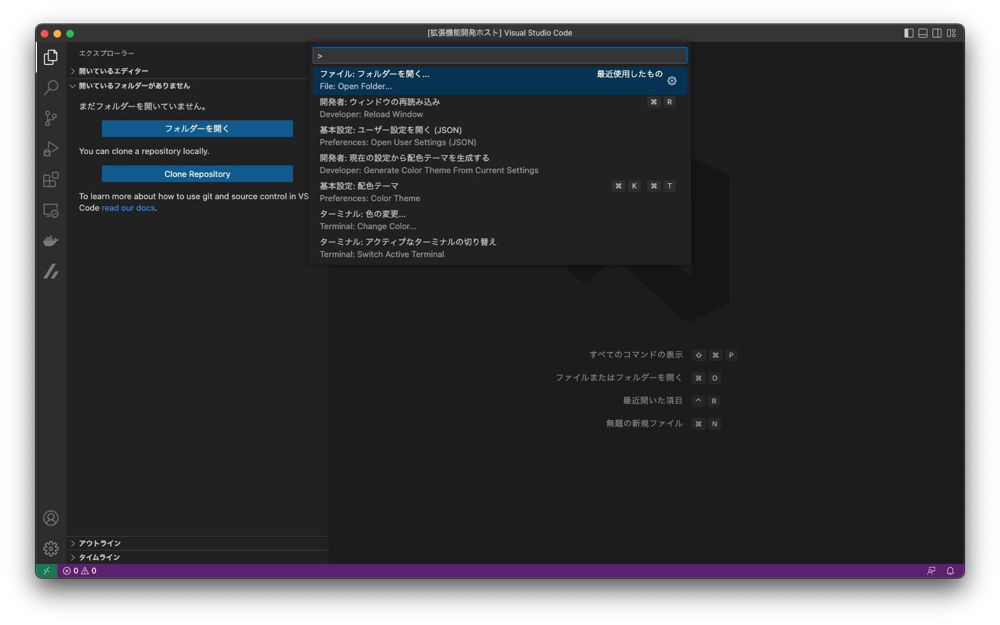
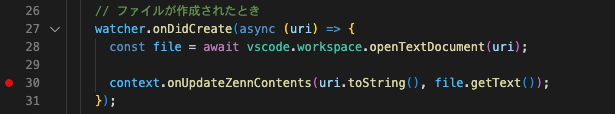
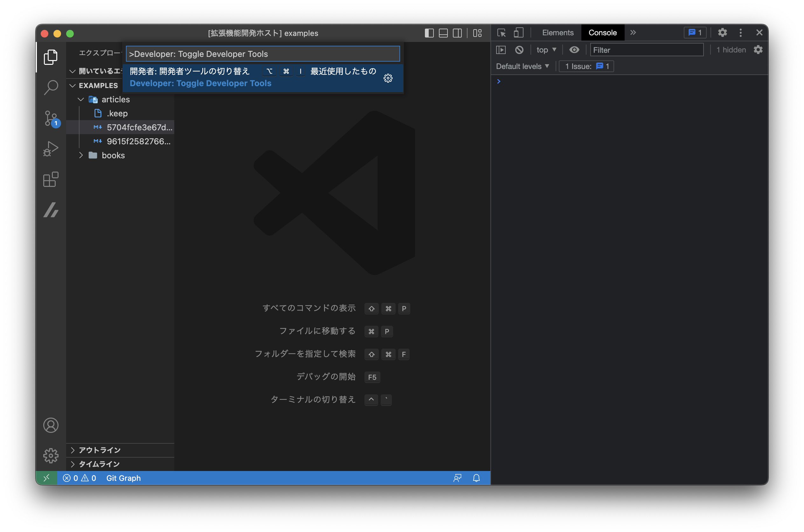

# zenn-vscode-extension

:::caution
この拡張はまだ β 版です
:::

VSCode の Web エディタ（github.dev など）で、Zenn の記事や本を執筆を補助するための[**VSCode Web 拡張機能**](https://code.visualstudio.com/api/extension-guides/web-extensions)です。

主な機能は以下の通りです。

- 記事や本をツリー表示
- 記事や本の雛形を作成
- 記事や本をプレビュー

詳細な使い方は [README](https://github.com/zenn-dev/zenn-vscode-extension#readme) を参照して下さい。

## ブランチ

- `canary`: 開発用のブランチです。通常はこのブランチから新しいブランチを切って Pull Request を作成します。
- `main`: リリース用のブランチです。通常は`canary`ブランチからのみマージを受け付けます。

## リリースについて

リリース手順は以下のようになります。

1. `canary` ブランチから `main` ブランチに対して Pull Request を作成します。
2. `release:patch`, `release:minor`, `release:major` のいずれかのラベルを Pull Request に付与します
3. ラベルが付与されるとバージョンアップコミットが Pull Request に追加されます
4. Pull Request をマージします ( ※ バージョンアップコミットが含まれていないとマージできません )
5. GitHub Actions によって、自動的に VSCode 拡張がリリースされます


## 開発環境
### セットアップ

このリポジトリでは pnpm を用いてパッケージ管理を行っています。
以下のコマンドを実行することで、必要なパッケージをインストールすることができます。

```shell
$> pnpm install
```

セットアップが正常に完了したあと、以下のコマンドを実行することでブラウザが開き拡張をローカル環境で試すことができます。

```shell
$> pnpm dev
```

:::note
このとき、[VSCode Insiders](https://code.visualstudio.com/insiders/) がインストールされます。
:::

上記のコマンドを実行すると、以下の画像のようなブラウザが開き、このリポジトリ内の `./examples` 内を表示されます。



### デバッグ方法

VSCode を使用している場合は [VSCode のデバッグ機能](https://code.visualstudio.com/docs/editor/debugging) を使用することで、
使用している VSCode 上で拡張機能を試すこともできます。

VSCode 上でデバッグビューを開き、`Run Web Extension` を選択します。



次に `F5` キーまたはデバッグ実行ボタンを押すと、別の VSCode ウィンドウが開き、そこでデバッグすることができます。



もしフォルダーが開かれていない場合や、任意のフォルダーを開きたい場合は、`フォルダーを開く` から任意のフォルダーを選択して開きます。



:::note
デフォルトではリポジトリ内の `./examples` が開かれます
:::

#### ブレークポイントを打ちたい場合

リポジトリを開いている VSCode で、停止したい箇所にブレークポイントを打ちます。



:::caution
拡張がインストールされている VSCode ではない点に注意してください
:::

次にデバッグを開始し、新規に開かれた VSCode のウィンドウで 開発者ツールの切り替え を実行し、Dev Tools を表示します。
ブラウザで開いている場合は、`F12` キーを押すことで Dev Tools を表示できます。



この状態で処理を実行すると、ブレークポイントを打った箇所で処理が停止しますが、
デバッグ画面はこのリポジトリを開いている VSCode であることに注意してください。

:::note
ブレークポイントが機能していない場合は、Developer: Reload Window コマンドを実行すると上手くいく可能性があります。
:::

### Hot Reload について

デバッグ中は Hot Reload が有効ですが、変更を適用するには Zenn の拡張がインストールされている VSCode ウィンドウで `Developer: Reload Window` を実行する必要があります。


### ビルド

`pnpm package-web` コマンドを実行することで、`./dist` にビルド結果が生成されます。
